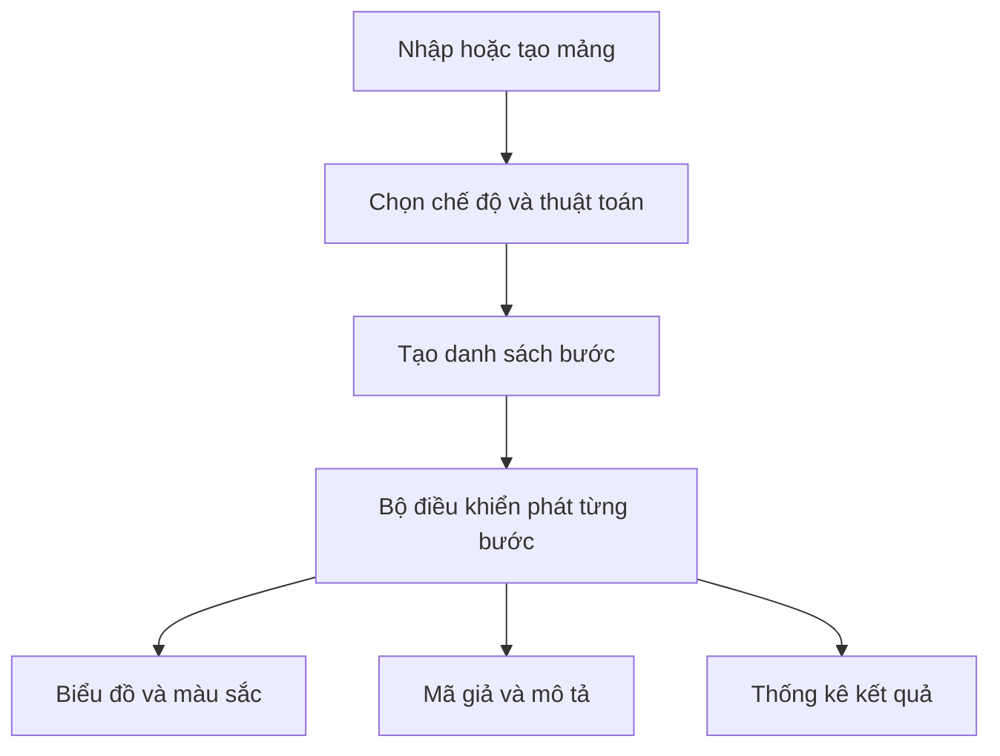

# TRỰC QUAN HÓA VÀ SO SÁNH CÁC THUẬT TOÁN SẮP XẾP

> **Sorting Lab** — Ứng dụng web hỗ trợ học, quan sát và thực nghiệm với năm thuật toán sắp xếp phổ biến.

## 1. Thông tin đồ án

| Nội dung | Thông tin |
|---|---|
| Học viên | huadinhkim |
| Mã lớp | DX24TT8 |
| Loại đồ án | Đồ án cơ sở ngành |
| Giảng viên hướng dẫn | ThS. Lê Phong Dũ |
| Tên đề tài | Trực quan hóa và so sánh các thuật toán sắp xếp |
| Repository | `csn-dx24tt8-huadinhkim-sorting-visualizer` |

## 2. Truy cập nhanh

| Nội dung | Liên kết |
|---|---|
| Website trực tuyến | [Mở Sorting Lab trên GitHub Pages](https://billy1688.github.io/csn-dx24tt8-huadinhkim-sorting-visualizer/) |
| Mã nguồn | [GitHub Repository](https://github.com/billy1688/csn-dx24tt8-huadinhkim-sorting-visualizer) |
| Kiểm tra tự động | [GitHub Actions](https://github.com/billy1688/csn-dx24tt8-huadinhkim-sorting-visualizer/actions) |
| Hướng dẫn cài đặt | [`setup/README.md`](setup/README.md) |

**Trạng thái hiện tại:** Đã hoàn thành các chức năng của ứng dụng; đang hoàn
thiện báo cáo và hồ sơ nộp đồ án.

## 3. Tiến độ thực hiện

| Tuần | Nội dung | Trạng thái |
|---|---|---|
| 01 | Tạo repository, README và đề cương | Hoàn thành |
| 02 | Phân tích yêu cầu, mô hình dữ liệu và thiết kế giao diện | Hoàn thành |
| 03 | Xây dựng Bubble Sort, Selection Sort và Insertion Sort | Hoàn thành |
| 04 | Xây dựng Merge Sort và Quick Sort | Hoàn thành |
| 05 | Hoàn thiện hoạt ảnh, mã giả, thống kê và bộ điều khiển | Hoàn thành |
| 06 | So sánh năm thuật toán và ba dạng dữ liệu đầu vào | Hoàn thành |
| 07 | Hoàn thiện lý thuyết, kiểm thử, tài liệu và sản phẩm | Đang hoàn thiện |

## 4. Giới thiệu

Đề tài xây dựng ứng dụng web trực quan hóa cách các thuật toán sắp xếp thay đổi
dữ liệu qua từng bước. Mỗi giá trị được biểu diễn bằng một cột; màu sắc cho biết
phần tử đang được so sánh, thay đổi hoặc đã về đúng vị trí. Mô phỏng được đồng bộ
với mã giả, lời giải thích và số liệu thống kê.

Ứng dụng không chỉ minh họa một thuật toán mà còn hỗ trợ hai dạng thực nghiệm:

- Chạy năm thuật toán trên cùng một mảng để so sánh kết quả.
- Chạy một thuật toán trên ba cách sắp xếp của cùng một tập giá trị: tăng dần,
  giảm dần và xáo trộn.

Khu vực lý thuyết được bổ sung để người học ghi nhớ tên, ý tưởng cốt lõi, dấu
hiệu nhận biết và điểm dễ nhầm của từng thuật toán.

## 5. Mục tiêu

- Minh họa chính xác quá trình so sánh và thay đổi dữ liệu của thuật toán.
- Đồng bộ biểu đồ cột, mã giả, mô tả và thống kê trên cùng màn hình.
- Cho phép chạy tự động, tạm dừng, tiếp tục, đi từng bước và quay lại bước trước.
- Đánh giá ảnh hưởng của thuật toán và thứ tự dữ liệu đầu vào.
- Hỗ trợ ôn tập lý thuyết và phân biệt các thuật toán dễ nhầm lẫn.
- Xuất kết quả thực nghiệm thành CSV để lưu trữ và đưa vào báo cáo.
- Kiểm tra mã nguồn tự động khi thay đổi được đẩy lên GitHub.

## 6. Chức năng hiện có

| Chế độ | Chức năng chính |
|---|---|
| **Trực quan** | Mô phỏng một thuật toán; chạy, tạm dừng, tiếp tục, bước trước, bước tiếp, đặt lại và điều chỉnh tốc độ. |
| **So sánh thuật toán** | Chạy cả năm thuật toán trên cùng dữ liệu; so sánh số lần so sánh, thao tác dữ liệu và thời gian trung bình. |
| **So sánh dữ liệu** | Dùng một thuật toán cho ba thứ tự đầu vào tăng dần, giảm dần và xáo trộn; hỗ trợ ba mô phỏng song song. |
| **Lý thuyết** | Tra cứu ý tưởng, câu ghi nhớ, các bước, độ phức tạp, tính ổn định, bộ nhớ và điểm dễ nhầm. |

Các chức năng dùng chung:

- Nhập mảng thủ công hoặc tạo mảng ngẫu nhiên.
- Chọn một trong năm thuật toán.
- Điều chỉnh tốc độ mô phỏng từ 1 đến 10.
- Tô màu phần tử theo trạng thái đang xét.
- Đánh dấu dòng mã giả tương ứng với bước hiện tại.
- Hiển thị số bước, số lần so sánh, số thao tác và thời gian mô phỏng.
- Xuất CSV tại hai chế độ so sánh.
- Giao diện đáp ứng cho máy tính và màn hình nhỏ.

## 7. Các thuật toán được hỗ trợ

| Thuật toán | Từ khóa ghi nhớ | Ý tưởng ngắn gọn | Tốt nhất | Trung bình | Xấu nhất | Bộ nhớ |
|---|---|---|---|---|---|---|
| Bubble Sort | **Nổi** | So sánh hai phần tử kề nhau, số lớn nổi dần về cuối | O(n) | O(n²) | O(n²) | O(1) |
| Selection Sort | **Chọn** | Chọn phần tử nhỏ nhất của đoạn chưa xếp và đưa về đầu | O(n²) | O(n²) | O(n²) | O(1) |
| Insertion Sort | **Chèn** | Lấy từng phần tử và chèn vào đoạn bên trái đã sắp xếp | O(n) | O(n²) | O(n²) | O(1) |
| Merge Sort | **Trộn** | Chia mảng thành các nửa nhỏ rồi trộn lại theo thứ tự | O(n log n) | O(n log n) | O(n log n) | O(n) |
| Quick Sort | **Chốt** | Chọn pivot, phân hoạch dữ liệu sang hai phía rồi đệ quy | O(n log n) | O(n log n) | O(n²) | O(log n) |

Quy tắc nhớ nhanh:

```text
Bubble nổi · Selection chọn · Insertion chèn · Merge trộn · Quick chốt
```

## 8. Quy định dữ liệu đầu vào

- Mảng có từ **5 đến 30 phần tử**.
- Mỗi phần tử là số nguyên từ **1 đến 100**.
- Có thể phân cách các số bằng dấu phẩy, dấu chấm phẩy hoặc khoảng trắng.

Ví dụ:

```text
42, 18, 76, 31, 55, 12, 68, 24
```

Chương trình sẽ báo lỗi nếu dữ liệu rỗng, không phải số nguyên, nằm ngoài phạm
vi cho phép hoặc có số lượng phần tử không hợp lệ.

## 9. Hướng dẫn sử dụng

### 9.1. Chế độ Trực quan

1. Nhập mảng và nhấn **Áp dụng**, hoặc chọn **Tạo mảng ngẫu nhiên**.
2. Chọn thuật toán và tốc độ.
3. Nhấn **Bắt đầu** để chạy tự động.
4. Dùng **Tạm dừng**, **Bước trước** và **Bước tiếp** để quan sát chi tiết.
5. Theo dõi đồng thời biểu đồ, dòng mã giả, lời giải thích và thống kê.
6. Nhấn **Đặt lại** để trở về dữ liệu ban đầu.

### 9.2. Chế độ So sánh thuật toán

1. Chuẩn bị một mảng ở bộ điều khiển.
2. Chọn **So sánh thuật toán**.
3. Chương trình chạy năm thuật toán trên đúng cùng dữ liệu.
4. Chọn tiêu chí để xem biểu đồ số lần so sánh, thao tác hoặc thời gian.
5. Nhấn **Xuất CSV** để lưu bảng kết quả.

### 9.3. Chế độ So sánh dữ liệu

1. Chọn một thuật toán ở bộ điều khiển.
2. Chọn **So sánh dữ liệu**.
3. Chương trình tạo ba mảng có cùng tập giá trị nhưng khác thứ tự: tăng dần,
   giảm dần và xáo trộn.
4. Nhấn **Chạy 3 mô phỏng** để quan sát song song.
5. So sánh số lần so sánh, số thao tác và thời gian của ba trường hợp.
6. Nhấn **Xuất CSV** nếu cần dùng số liệu cho báo cáo.

### 9.4. Chế độ Lý thuyết

1. Chọn **Lý thuyết**.
2. Chọn thuật toán cần ôn tập.
3. Đọc từ khóa, liên tưởng, các bước, dấu hiệu nhận biết và độ phức tạp.
4. Nhấn **Xem mô phỏng** để chuyển sang minh họa thuật toán đang chọn.

## 10. Cách đọc kết quả thống kê

| Chỉ số | Ý nghĩa |
|---|---|
| Số bước | Số hành động trực quan đã phát trong mô phỏng |
| Số lần so sánh | Số lần thuật toán đối chiếu các giá trị |
| Thao tác dữ liệu | Hoán đổi, dịch chuyển hoặc ghi mảng tùy từng thuật toán |
| Thời gian mô phỏng | Thời gian phát hoạt ảnh, phụ thuộc tốc độ người dùng chọn |
| Thời gian trung bình | Thời gian chạy logic thuật toán nhiều lần, không bao gồm hoạt ảnh |

Không nên dùng **thời gian mô phỏng** để kết luận thuật toán nào nhanh hơn vì
chỉ số này chịu ảnh hưởng trực tiếp từ tốc độ hoạt ảnh. Thời gian trung bình
trong chế độ so sánh phù hợp hơn, nhưng vẫn có thể thay đổi theo trình duyệt,
thiết bị và tiến trình đang chạy.

Các thuật toán cũng sử dụng loại thao tác khác nhau. Ví dụ, Merge Sort ghi giá
trị vào mảng, còn Bubble Sort thường hoán đổi hai phần tử. Vì vậy cần đọc số
thao tác cùng với nguyên lý của thuật toán thay vì xem chúng là chi phí hoàn
toàn tương đương.

## 11. Mô hình hoạt động



Thuật toán và phần giao diện được tách riêng. Mỗi thuật toán không trực tiếp vẽ
cột mà sinh ra một danh sách bước, ví dụ:

```javascript
{
  type: "compare",
  array: [18, 42, 31],
  indices: [0, 1],
  codeLine: 3,
  comparisonsDelta: 1,
  swapsDelta: 0,
  description: "So sánh 18 và 42."
}
```

Bộ trực quan hóa đọc lần lượt các bước để cập nhật mảng, màu sắc, mã giả và số
liệu. Cách tổ chức này giúp logic sắp xếp không phụ thuộc tốc độ hoạt ảnh, đồng
thời hỗ trợ tạm dừng, đi tới hoặc quay lại từng bước.

## 12. Công nghệ sử dụng

- HTML5.
- CSS3 và CSS Transition.
- JavaScript thuần.
- Web APIs: DOM, `performance.now()`, Blob và tải file CSV.
- Git và GitHub.
- GitHub Actions để kiểm tra mã nguồn tự động.
- GitHub Pages là lựa chọn triển khai khi repository và tài khoản đáp ứng điều kiện.

Ứng dụng không dùng backend, cơ sở dữ liệu, framework JavaScript hoặc thư viện
biểu đồ bắt buộc.

## 13. Cấu trúc repository

```text
.
├── .github/
│   └── workflows/          # Kiểm tra source và triển khai tùy chọn
├── progress-report/        # Báo cáo tiến độ từng tuần
├── setup/                  # Hướng dẫn cài đặt và sử dụng
├── src/
│   ├── index.html          # Giao diện chính
│   ├── css/
│   │   └── style.css       # Bố cục, màu sắc và responsive
│   ├── assets/             # Tài nguyên giao diện nếu có
│   └── js/
│       ├── app.js          # Trạng thái, điều khiển và sự kiện
│       ├── visualizer.js   # Biểu đồ, màu sắc và mã giả
│       ├── comparison.js   # Đo và so sánh kết quả
│       ├── theory.js       # Nội dung lý thuyết
│       └── algorithms/     # Năm thuật toán sinh danh sách bước
├── tests/
│   └── source.test.cjs     # Kiểm tra tự động bằng Node.js
├── others/
│   ├── doc/                # Tài liệu Word
│   ├── pdf/                # Tài liệu PDF
│   ├── html/               # Tài liệu HTML
│   └── abs/                # Tài liệu khác
├── soft/                   # Phần mềm hoặc tài nguyên hỗ trợ
└── README.md
```

## 14. Cài đặt và chạy chương trình

### 14.1. Clone bằng SSH

```bash
git clone git@github.com:billy1688/csn-dx24tt8-huadinhkim-sorting-visualizer.git
cd csn-dx24tt8-huadinhkim-sorting-visualizer
```

### 14.2. Clone bằng HTTPS

```bash
git clone https://github.com/billy1688/csn-dx24tt8-huadinhkim-sorting-visualizer.git
cd csn-dx24tt8-huadinhkim-sorting-visualizer
```

### 14.3. Mở trực tiếp

Mở `src/index.html` bằng Google Chrome, Microsoft Edge hoặc Firefox. Ứng dụng
không cần chạy `npm install` và không cần cấu hình cơ sở dữ liệu.

### 14.4. Chạy bằng Live Server

1. Mở repository bằng Visual Studio Code.
2. Cài tiện ích **Live Server**.
3. Nhấn chuột phải vào `src/index.html`.
4. Chọn **Open with Live Server**.

### 14.5. Chạy bằng Python HTTP Server

```bash
python3 -m http.server 8000 --directory src
```

Sau đó mở `http://localhost:8000`. Nhấn `Ctrl + C` để dừng máy chủ.

## 15. Kiểm tra mã nguồn

Nếu máy đã có Node.js, chạy kiểm tra tại thư mục gốc:

```bash
node --test tests/source.test.cjs
```

Bộ kiểm tra xác nhận:

- Tất cả file JavaScript có cú pháp hợp lệ.
- Các file JavaScript và CSS được `index.html` tham chiếu đều tồn tại.
- Năm thuật toán sắp xếp đúng với mảng tăng dần, giảm dần, xáo trộn, có giá
  trị trùng và mảng một phần tử.
- Logic mô phỏng và logic so sánh thống nhất số lần so sánh, số thao tác.
- Ba dạng đầu vào giữ nguyên cùng tập giá trị.

Khi push lên GitHub, mở **Actions → Kiểm tra mã nguồn**. Kết quả đạt khi job
`check-source` có dấu tích xanh và hiển thị `7 passed, 0 failed`.

## 16. GitHub Pages

Repository có thể chứa workflow triển khai thư mục `src` lên GitHub Pages. Với
tài khoản GitHub Free, Pages dùng miễn phí cho repository **Public**; repository
**Private** có thể yêu cầu gói phù hợp.

Website của đồ án: [Sorting Lab trên GitHub Pages](https://billy1688.github.io/csn-dx24tt8-huadinhkim-sorting-visualizer/).

Khi tính năng đã được bật:

1. Vào **Settings → Pages**.
2. Tại **Build and deployment**, chọn **GitHub Actions**.
3. Push nhánh `main` và mở **Actions → Triển khai GitHub Pages**.
4. Khi hai job `build` và `deploy` đều xanh, mở **Settings → Pages → Visit site**.

Nếu repository chưa đáp ứng điều kiện Pages, ứng dụng vẫn chạy bình thường trên
máy bằng `src/index.html`, Live Server hoặc Python HTTP Server.

## 17. Kết quả đạt được

- Hoàn thành mô phỏng cho năm thuật toán trong phạm vi đề tài.
- Đồng bộ hình ảnh, mã giả, mô tả và thống kê theo từng bước.
- Hoàn thành chế độ so sánh năm thuật toán trên cùng dữ liệu.
- Hoàn thành chế độ so sánh ba dạng đầu vào bằng cùng một thuật toán.
- Bổ sung khu vực lý thuyết giúp ghi nhớ và phân biệt thuật toán.
- Bổ sung nút bước trước và xuất kết quả CSV.
- Bổ sung kiểm tra mã nguồn tự động trên GitHub Actions.

## 18. Ưu điểm

- Giao diện trực quan, tập trung vào mục tiêu học tập.
- Mô phỏng, mã giả và thống kê được hiển thị đồng thời.
- Có thể kiểm soát quá trình bằng các nút chạy, dừng và từng bước.
- Kết hợp lý thuyết với thực nghiệm trong cùng một ứng dụng.
- Không yêu cầu backend, cơ sở dữ liệu hoặc cài nhiều thư viện.
- Cấu trúc tách thuật toán khỏi giao diện, thuận tiện mở rộng.

## 19. Hạn chế

- Số phần tử được giới hạn để bảo đảm hoạt ảnh dễ quan sát.
- Thời gian đo phụ thuộc trình duyệt, thiết bị và tiến trình đang chạy.
- Các loại thao tác của từng thuật toán không hoàn toàn tương đương.
- Quick Sort dùng phần tử cuối làm pivot nên có thể gặp trường hợp xấu với dữ
  liệu đã có thứ tự.
- Chưa lưu lịch sử nhiều phiên thực nghiệm trong trình duyệt.
- Chưa có bài trắc nghiệm tự đánh giá kiến thức.

## 20. Hướng phát triển

- Thêm Heap Sort, Shell Sort và Counting Sort.
- Cho phép chọn chiến lược pivot của Quick Sort.
- Lưu nhiều lần thực nghiệm và tổng hợp kết quả trung bình.
- Xuất biểu đồ thành hình ảnh để đưa vào báo cáo.
- Bổ sung bộ câu hỏi trắc nghiệm theo từng thuật toán.
- Cải thiện khả năng sử dụng bằng bàn phím và thiết bị di động.

## 21. Lỗi thường gặp

### Giao diện chưa cập nhật sau khi sửa source

- Nhấn `Ctrl + F5` để tải lại và bỏ bộ nhớ đệm.
- Chạy `git status` để xem file đã được theo dõi chưa.
- Kiểm tra file đã được `git add`, commit và push chưa.
- Kiểm tra đường dẫn trong `src/index.html`; máy chủ Linux phân biệt chữ hoa và
  chữ thường trong tên file.

### Một chế độ không hoạt động

- Nhấn `F12`, mở thẻ **Console** và xem lỗi màu đỏ đầu tiên.
- Kiểm tra file JavaScript tương ứng có tồn tại trong `src/js` và trên GitHub.
- Chạy `node --test tests/source.test.cjs` để phát hiện lỗi cú pháp hoặc thuật toán.

### GitHub Actions có dấu đỏ

1. Mở thẻ **Actions**.
2. Chọn workflow và lần chạy gắn với commit mới nhất.
3. Mở job và bước có dấu đỏ.
4. Đọc dòng lỗi đầu tiên phía trên `Process completed with exit code 1`.

Dấu đỏ không xóa commit nhưng cho biết mã nguồn hoặc cấu hình workflow chưa đạt.

### Git push yêu cầu mật khẩu

GitHub không chấp nhận mật khẩu tài khoản cho Git qua HTTPS. Nếu máy đã có SSH
key, chuyển repository sang SSH:

```bash
git remote set-url origin git@github.com:billy1688/csn-dx24tt8-huadinhkim-sorting-visualizer.git
ssh -T git@github.com
git push
```

## 22. Tài liệu liên quan

- `setup/README.md`: hướng dẫn cài đặt, chạy chương trình và xử lý lỗi.
- `progress-report/`: báo cáo tiến độ từng tuần.
- `src/js/algorithms/README.md`: mô tả phần mã nguồn thuật toán.
- `others/doc/`: đề cương và báo cáo Word.
- `others/pdf/`: tài liệu PDF xuất từ báo cáo.

## 23. Kết luận

Đồ án đã vận dụng kiến thức cấu trúc dữ liệu và giải thuật vào một sản phẩm web
có thể mô phỏng, phân tích và hỗ trợ ôn tập. Việc tách thuật toán thành các bước
trung gian giúp người học quan sát rõ dữ liệu thay đổi như thế nào, đồng thời
tạo cơ sở để so sánh ảnh hưởng của thuật toán và dữ liệu đầu vào bằng các chỉ số
cụ thể.

Ứng dụng được xây dựng cho mục đích học tập và báo cáo đồ án cơ sở ngành của
học viên **huadinhkim — DX24TT8**.
