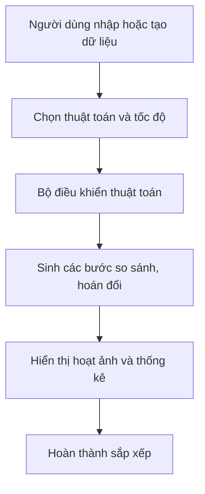
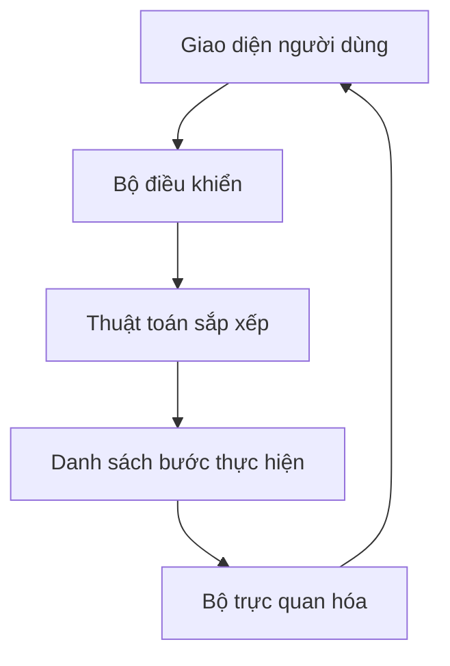

# BÁO CÁO TIẾN ĐỘ TUẦN 02

## 1. Thông tin chung

- Học viên: huadinhkim
- Mã lớp: DX24TT8
- Đề tài: Trực quan hóa và so sánh các thuật toán sắp xếp
- Nội dung tuần: Phân tích yêu cầu và thiết kế ứng dụng

## 2. Mục tiêu tuần 02

- Phân tích yêu cầu của ứng dụng.
- Xác định các chức năng chính.
- Xây dựng mô hình hoạt động của chương trình.
- Xác định cấu trúc dữ liệu cần sử dụng.
- Thiết kế bố cục giao diện ứng dụng.
- Chuẩn bị cho việc lập trình thuật toán ở tuần tiếp theo.

## 3. Đối tượng sử dụng

Ứng dụng được xây dựng dành cho:

- Sinh viên đang học cấu trúc dữ liệu và giải thuật.
- Người muốn tìm hiểu cách hoạt động của thuật toán sắp xếp.
- Người dùng muốn so sánh hiệu quả giữa các thuật toán.

## 4. Yêu cầu chức năng

### 4.1. Chức năng bắt buộc

| Mã | Chức năng | Mô tả |
|---|---|---|
| FR-01 | Tạo dữ liệu ngẫu nhiên | Sinh một mảng số ngẫu nhiên |
| FR-02 | Nhập dữ liệu | Cho phép nhập danh sách số thủ công |
| FR-03 | Chọn thuật toán | Chọn thuật toán cần trực quan hóa |
| FR-04 | Bắt đầu | Chạy quá trình sắp xếp |
| FR-05 | Tạm dừng | Tạm dừng hoạt ảnh |
| FR-06 | Tiếp tục | Tiếp tục quá trình đang tạm dừng |
| FR-07 | Chạy từng bước | Quan sát từng bước của thuật toán |
| FR-08 | Điều chỉnh tốc độ | Thay đổi tốc độ hoạt ảnh |
| FR-09 | Đặt lại | Khôi phục mảng ban đầu |
| FR-10 | Hiển thị thống kê | Hiển thị số lần so sánh, hoán đổi và thời gian |

### 4.2. Chức năng trực quan

- Mỗi số được biểu diễn bằng một cột.
- Chiều cao cột tương ứng với giá trị của số.
- Phần tử đang được so sánh được tô màu vàng.
- Phần tử đang được hoán đổi được tô màu đỏ.
- Phần tử đã đúng vị trí được tô màu xanh.
- Hiển thị tên và độ phức tạp của thuật toán.
- Hiển thị mã giả và đánh dấu dòng đang thực hiện.

### 4.3. Phạm vi thuật toán

Ứng dụng dự kiến hỗ trợ:

1. Bubble Sort.
2. Selection Sort.
3. Insertion Sort.
4. Merge Sort.
5. Quick Sort.

Trong giai đoạn đầu, chương trình ưu tiên ba thuật toán:

1. Bubble Sort.
2. Selection Sort.
3. Insertion Sort.

Merge Sort và Quick Sort sẽ được bổ sung sau khi chương trình cơ bản
hoạt động ổn định.

## 5. Yêu cầu phi chức năng

- Giao diện dễ quan sát và sử dụng.
- Chương trình chạy trên trình duyệt web.
- Không yêu cầu người dùng cài đặt phần mềm phức tạp.
- Hoạt ảnh phải thể hiện đúng các bước của thuật toán.
- Chương trình không bị lỗi khi nhập mảng rỗng hoặc dữ liệu không hợp lệ.
- Giao diện có thể hiển thị trên máy tính và điện thoại.

## 6. Mô hình hoạt động

## 7. Mô hình các thành phần chương trình

Các thành phần chính:

- Giao diện: tiếp nhận lựa chọn của người dùng.
- Bộ điều khiển: quản lý chạy, dừng, tốc độ và đặt lại.
- Thuật toán: thực hiện logic sắp xếp.
- Danh sách bước: lưu các hành động so sánh và hoán đổi.
- Bộ trực quan hóa: chuyển từng bước thành hoạt ảnh.

## 8. Dữ liệu của chương trình

### 8.1. Trạng thái ứng dụng

| Thuộc tính | Kiểu dữ liệu | Ý nghĩa |
|---|---|---|
| originalArray | Array Number | Mảng dữ liệu ban đầu |
| currentArray | Array Number | Mảng tại thời điểm đang chạy |
| algorithm | String | Thuật toán được chọn |
| speed | Number | Tốc độ hoạt ảnh |
| status | String | idle, running, paused hoặc completed |
| currentStep | Number | Bước đang thực hiện |
| comparisons | Number | Tổng số lần so sánh |
| swaps | Number | Tổng số lần hoán đổi |
| elapsedTime | Number | Thời gian thực hiện |

### 8.2. Dữ liệu của một bước

| Thuộc tính | Ý nghĩa |
|---|---|
| type | Loại hành động: compare, swap, overwrite hoặc sorted |
| indices | Vị trí các phần tử bị tác động |
| values | Giá trị của phần tử tại bước hiện tại |
| codeLine | Dòng mã giả tương ứng |
| description | Nội dung giải thích bước đang chạy |

## 9. Thiết kế giao diện dự kiến

Giao diện được chia thành các khu vực:

### 9.1. Thanh tiêu đề

- Tên đề tài.
- Giới thiệu ngắn về ứng dụng.
- Tên thuật toán đang được chọn.

### 9.2. Khu vực điều khiển

- Ô nhập dữ liệu.
- Nút tạo dữ liệu ngẫu nhiên.
- Danh sách chọn thuật toán.
- Thanh điều chỉnh tốc độ.
- Nút Chạy.
- Nút Tạm dừng.
- Nút Tiếp tục.
- Nút Chạy từng bước.
- Nút Đặt lại.

### 9.3. Khu vực trực quan

- Hiển thị các phần tử bằng biểu đồ cột.
- Sử dụng màu sắc để biểu diễn trạng thái.
- Hiển thị giá trị của từng phần tử.

### 9.4. Khu vực mã giả

- Hiển thị mã giả của thuật toán.
- Đánh dấu dòng lệnh đang được thực hiện.
- Giải thích hành động tại bước hiện tại.

### 9.5. Khu vực thống kê

- Số phần tử.
- Số lần so sánh.
- Số lần hoán đổi.
- Thời gian chạy.
- Độ phức tạp thời gian và không gian.

## 10. Kết quả đạt được

- Đã xác định phạm vi ứng dụng.
- Đã xác định chức năng bắt buộc và chức năng mở rộng.
- Đã xây dựng mô hình hoạt động.
- Đã xác định cấu trúc dữ liệu.
- Đã thiết kế bố cục giao diện dự kiến.
- Đã chuẩn bị kế hoạch xây dựng chương trình.

## 11. Khó khăn

- Cần tách phần thực hiện thuật toán khỏi phần hoạt ảnh.
- Cần bảo đảm tốc độ hoạt ảnh không làm thay đổi kết quả thuật toán.
- Chức năng chạy từng bước và đánh dấu dòng mã cần được đồng bộ.

## 12. Kế hoạch tuần tiếp theo

- Xây dựng giao diện HTML và CSS.
- Xây dựng chức năng tạo mảng ngẫu nhiên.
- Hiển thị mảng bằng biểu đồ cột.
- Lập trình thuật toán Bubble Sort.
- Ghi nhận các bước so sánh và hoán đổi.
