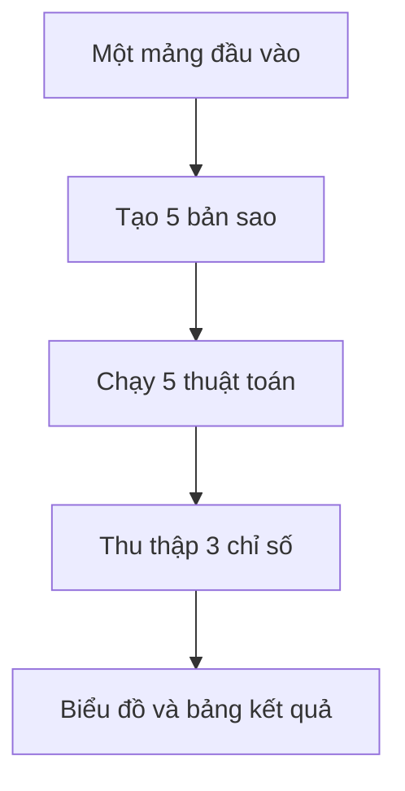
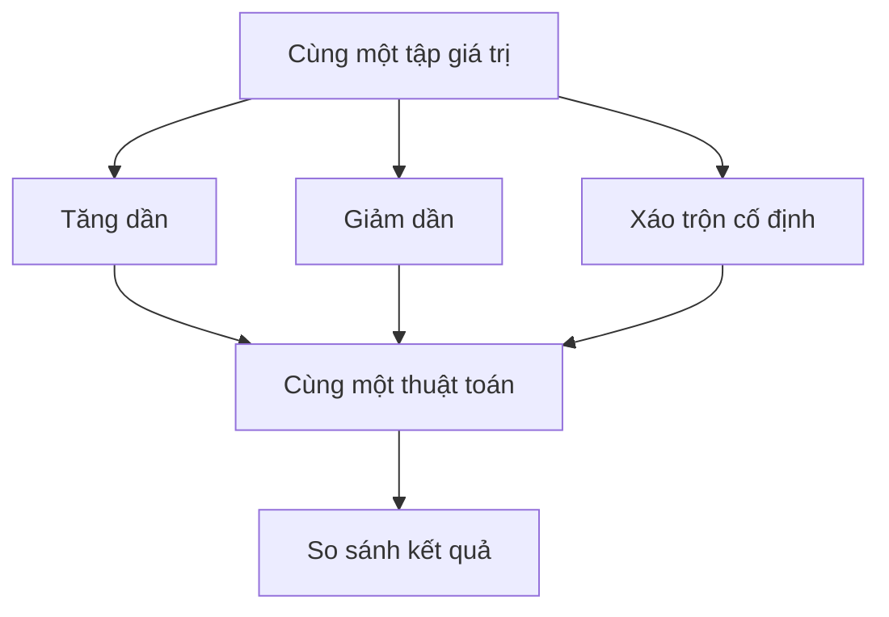

# BÁO CÁO TIẾN ĐỘ TUẦN 06

## 1. Thông tin chung

- Học viên: huadinhkim
- Mã lớp: DX24TT8
- Đề tài: Trực quan hóa và so sánh các thuật toán sắp xếp
- Nội dung tuần: Xây dựng chức năng thực nghiệm và so sánh
- Thời gian báo cáo: [Điền ngày bắt đầu và kết thúc tuần]

## 2. Mục tiêu

- So sánh năm thuật toán trên cùng một dữ liệu đầu vào.
- Khảo sát ảnh hưởng của thứ tự đầu vào đến một thuật toán.
- Thu thập số lần so sánh, thao tác dữ liệu và thời gian chạy.
- Trình bày kết quả bằng biểu đồ, bảng và mô phỏng song song.
- Bảo đảm điều kiện thí nghiệm công bằng và có thể lặp lại.

## 3. Mô hình thực nghiệm

### 3.1. So sánh năm thuật toán

Một mảng được sao chép thành năm bản giống nhau. Mỗi thuật toán nhận một bản
sao riêng để dữ liệu đầu vào không bị thay đổi bởi thuật toán chạy trước.

Các chỉ số gồm:

- Số lần so sánh giữa các giá trị.
- Số lần hoán đổi, dịch chuyển hoặc ghi mảng.
- Thời gian chạy trung bình, không bao gồm hoạt ảnh.

### 3.2. So sánh ba dạng dữ liệu

Từ cùng một tập giá trị, chương trình tạo ba trường hợp:

1. Dữ liệu tăng dần.
2. Dữ liệu giảm dần.
3. Dữ liệu xáo trộn.

Chương trình giữ nguyên thuật toán và tập giá trị, chỉ thay đổi thứ tự đầu
vào. Nhờ đó có thể quan sát riêng ảnh hưởng của cấu trúc dữ liệu.

Bản xáo trộn được tạo theo giá trị khởi tạo cố định. Khi dữ liệu gốc không
thay đổi, thứ tự xáo trộn cũng không thay đổi, giúp thí nghiệm có thể lặp lại.

## 4. Chức năng đã xây dựng

### 4.1. Chế độ So sánh thuật toán

- Chạy Bubble, Selection, Insertion, Merge và Quick Sort.
- Hiển thị thuật toán có ít so sánh nhất.
- Hiển thị thuật toán có ít thao tác nhất.
- Hiển thị thời gian đo thấp nhất.
- Cho phép đổi tiêu chí trên biểu đồ.
- Hiển thị bảng kết quả chi tiết.

### 4.2. Chế độ So sánh dữ liệu

- Chọn một trong năm thuật toán.
- Tạo ba mảng có cùng tập giá trị.
- Hiển thị số liệu cho từng dạng đầu vào.
- Tô nổi bật kết quả thấp nhất của từng tiêu chí.
- Chạy ba mô phỏng song song.
- Có thể tạm dừng, tiếp tục và thay đổi tốc độ mô phỏng.

## 5. Nhận xét lý thuyết

| Thuật toán | Ảnh hưởng của thứ tự đầu vào |
|---|---|
| Bubble Sort | Tăng dần tốt nhất khi có dừng sớm; giảm dần cần nhiều đổi chỗ |
| Selection Sort | Số lần so sánh gần như không đổi giữa các thứ tự |
| Insertion Sort | Tăng dần tốt nhất; giảm dần cần nhiều dịch chuyển nhất |
| Merge Sort | Thời gian vẫn thuộc O(n log n) ở các trường hợp |
| Quick Sort | Với pivot cuối, tăng/giảm dần có thể gây trường hợp O(n²) |

Kết quả thời gian thực tế có thể thay đổi theo trình duyệt và thiết bị, vì
vậy thời gian được đo nhiều lần và lấy giá trị trung bình.

## 6. Kiểm thử

- Xác nhận ba mảng có cùng số lượng và cùng tập giá trị.
- Xác nhận bản tăng dần và giảm dần được tạo đúng.
- Xác nhận bản xáo trộn có thể tạo lại giống nhau.
- Xác nhận nhận kết quả cuối của cả năm thuật toán là tăng dần.
- Đối chiếu số so sánh và thao tác với danh sách bước mô phỏng.
- Kiểm tra chuyển đổi qua lại giữa các chế độ.

## 7. Kết quả đạt được

Ứng dụng không chỉ minh họa cách thuật toán hoạt động mà còn hỗ trợ thực
nghiệm hai câu hỏi:

1. Cùng dữ liệu đầu vào, thuật toán nào thực hiện ít thao tác hơn?
2. Cùng một thuật toán, thứ tự đầu vào ảnh hưởng đến kết quả đo như thế nào?

## 8. Kế hoạch tuần tiếp theo

- Bổ sung phần lý thuyết để tra cứu và ôn tập.
- Hoàn thiện tài liệu cài đặt và hướng dẫn sử dụng.
- Kiểm tra toàn bộ mã nguồn và đường dẫn file.
- Hoàn thiện báo cáo, kết luận và chuẩn bị sản phẩm nộp.

